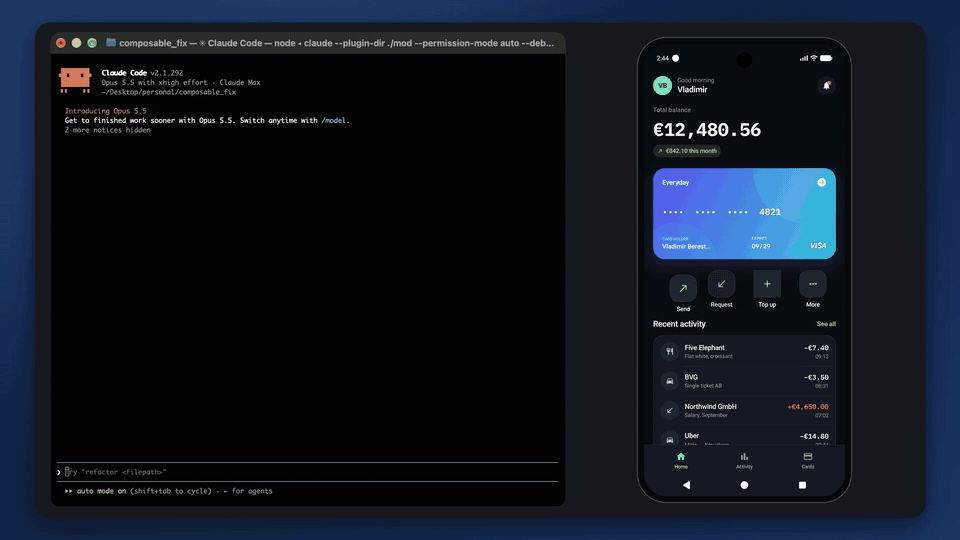

# ComposableFix

[English](README.md) | [O'zbekcha](README.uz.md) | **Русский**

Зажмите любой элемент вашего Jetpack Compose-приложения в debug-сборке, напишите, что не так, и нажмите Return. Отчёт попадёт в сессию Claude Code, которая уже запущена в вашем проекте: элемент, строка Kotlin-кода, которая его помечает, скриншот и ваш комментарий. Claude исправит код, заново установит и запустит приложение, а баннер в приложении покажет весь путь исправления — от постановки в очередь до появления на экране.



[Смотреть демо в полном качестве (MP4, 72 с)](docs/demo.mp4). Оно записано вживую в эмуляторе Android: сессия Claude Code в терминале с плагином исправила по отчётам четыре специально заложенных бага в Tally. Ускорены только паузы ожидания.

ComposableFix — это порт [FixKit](https://github.com/ostiums/fixkit) на Jetpack Compose; FixKit делает то же самое для SwiftUI-приложений в симуляторе iOS. Для Flutter-приложений есть [WidgetFix](https://github.com/ushodmonov/widget_fix).

ComposableFix состоит из двух частей:

- **плагин composablefix** для Claude Code принимает отчёты и в терминале, и в расширении VS Code: его MCP-сервер запускает ресивер, его command-хуки следят за каждым отчётом, а его мод отправляет каждый отчёт промптом сразу, как тот пришёл;
- **Android-библиотека ComposableFix** отправляет их из debug-сборки. Release-сборки вместо неё подключают `composablefix-noop`, которая ничего не делает.

## Требования

- Claude Code 2.1.287 или новее.
- Node.js 18.2 или новее: на нём работают ресивер и хуки плагина.
- Jetpack Compose 1.10 или новее, а для скриншотов — Android 8.0 (API 26) или новее. Библиотека собирается начиная с API 23; там она рисует скриншот сама.
- Эмулятор Android или устройство, подключённое по USB или через wireless debugging.
- adb из platform-tools Android SDK. Он определяет, на какой элемент пришлось нажатие из отчёта, и позволяет устройству достучаться до Mac. Плагин ищет его в `COMPOSABLEFIX_ADB`, затем в `ANDROID_HOME` и `ANDROID_SDK_ROOT`, затем в `PATH`, затем в `~/Library/Android/sdk`. Без adb отчёты из эмулятора всё равно приходят со скриншотом и точкой нажатия.

## Установка

### 1. Плагин

```bash
claude plugin marketplace add ushodmonov/composable_fix
claude plugin install composablefix@composablefix
```

После этого плагин загружается в каждой сессии Claude Code — и в терминале, и в расширении VS Code. Отчёты принимает только сессия, запущенная в проекте, который использует ComposableFix, или в папке до двух уровней выше него: её MCP-сервер запускает ресивер вместе с сессией и останавливает при её завершении. Сессии в других папках отчёты не трогают; см. [Несколько проектов](#несколько-проектов). Мод WidgetFix использует тот же порт 4747, поэтому включайте только один из двух.

### 2. Библиотека

Пока библиотека не опубликована, подключите Android-сборку этого репозитория из локальной копии. Gradle подменит обе координаты её модулями. В `settings.gradle.kts`:

```kotlin
includeBuild("../composable_fix/android")
```

В `build.gradle.kts` модуля приложения:

```kotlin
dependencies {
    debugImplementation("dev.composablefix:composablefix:0.1.0")
    releaseImplementation("dev.composablefix:composablefix-noop:0.1.0")
}
```

Другой вариант — `./gradlew publishToMavenLocal` в папке `android/`: он публикует обе библиотеки в `~/.m2`, и проект берёт их из `mavenLocal()`.

### 3. Одна обёртка вокруг корня

```kotlin
import dev.composablefix.ComposableFixHost

class MainActivity : ComponentActivity() {
    override fun onCreate(savedInstanceState: Bundle?) {
        enableEdgeToEdge()
        super.onCreate(savedInstanceState)
        setContent {
            ComposableFixHost {
                App()
            }
        }
    }
}
```

Вот и вся интеграция. Библиотека добавляет debug-сборкам разрешение `INTERNET` и не требует network security config: с ресивером она общается через обычный сокет, на который ограничения cleartext не распространяются. Что делает хост, объясняется в следующем разделе.

### 4. Папка проекта

Плагин записывает отчёты в `.composablefix/` в корне Gradle-проекта, в папке с `settings.gradle.kts`; добавьте `.composablefix/` в `.gitignore`. Запускайте `claude` в этой папке или в папке до двух уровней выше, как в репозитории с приложением в `android/`: плагин находит ближайший проект ниже и даёт Claude все пути от папки сессии (`android/.composablefix/reports/r1.png`). В VS Code сессия расширения работает в папке, открытой в VS Code. Чтобы Claude мог открывать скриншоты, не спрашивая каждый раз, разрешите это в настройках Claude Code для проекта:

```json
{ "permissions": { "allow": ["Read(./.composablefix/**)"] } }
```

В сессии выше проекта путь включает папку проекта: `Read(./android/.composablefix/**)`. Перед запуском установки через Gradle и команд `adb` Claude спросит разрешения, если их тоже не добавить в список.

## Зачем `ComposableFixHost` оборачивает корень

Пока этот composable не запущен, библиотека ничего не делает. Он выполняет пять задач:

- **Долгое нажатие.** Он видит каждое нажатие раньше жестов самого приложения, на initial pass в Compose. Кнопки, списки и пейджеры продолжают работать. Если нажатие длится полсекунды без движения, оно переходит к ComposableFix: остаток жеста поглощается (consume), поэтому элемент под пальцем на него не реагирует.
- **Окно комментария.** Он рисует затемнённый экран с подсвеченным элементом и поле комментария над клавиатурой. Если клавиатура закроет элемент, он сдвигает приложение вверх. Кнопка Back закрывает окно.
- **Баннеры.** Он показывает ход отчёта вверху экрана: отправлен, в очереди, исправляется, пересобирается, исправлен.
- **Сигнал запуска.** При старте процесса он сообщает ресиверу, что приложение запущено. Запуск, пока Claude работает над отчётом, — это то, по чему плагин узнаёт, что исправление уже на экране, неважно, установил ли его Claude через Gradle или вы нажали Run в Android Studio. После перезапуска приложение снова следит за ходом отчёта. Activity, пересозданная из-за поворота экрана или складывания устройства, запуском не считается.
- **Тест-теги в дереве доступности.** Он включает `testTagsAsResourceId`, поэтому `Modifier.testTag` попадает в отчёты как идентификатор элемента.

Окно комментария и баннеры рисуются поверх контента, переданного в `ComposableFixHost`. Если обернуть весь `setContent` активити, они закрывают весь экран, поверх навигации и таб-баров. Поэтому оборачивайте корень один раз: второй хост нарисует второе окно комментария. Диалоги, попапы и `ModalBottomSheet` — это отдельные окна над хостом, поэтому долгое нажатие внутри них ничего не делает.

В release-сборке `composablefix-noop` даёт те же функции: `ComposableFixHost` просто рисует контент, а метки возвращают модификатор без изменений. В APK не остаётся ни библиотеки, ни её разрешения.

## Как пользоваться `Modifier.fixable`

Помечать ничего не обязательно. Без меток ресивер читает дерево доступности экрана через `uiautomator dump` и называет элемент под пальцем вместе с подписями рядом с ним. Затем Claude находит composable, ища эти подписи в исходниках:

```
Income should be green

[fix r1] TextView "+€4,650.00" near "Northwind GmbH", "Salary, September" · Activity screen · dev.composablefix.tally/.MainActivity on emulator-5554 · .composablefix/reports/r1.png
```

В конце строки стоят компонент запуска приложения и adb-серийник устройства: по ним Claude запускает приложение заново. Пометьте элемент `Modifier.fixable`, если хотите, чтобы его отчёты указывали на точную строку:

```kotlin
@Composable
fun WalletCard(card: PaymentCard, modifier: Modifier = Modifier) {
    Column(modifier) {
        Text(card.number, Modifier.fixable("card.number"))
        Text(card.holder, Modifier.width(110.dp).fixable("card.holderName"))
    }
}

WalletCard(card, Modifier.fixable("home.walletCard"))
```

Что меняет метка:

- **Отчёт называет элемент и его строку.** Метка запоминает файл и строку, откуда её вызвали, читая их из стека вызовов. Приложение знает файл только по папкам пакета (`dev/composablefix/tally/features/home/WalletCard.kt`), а ресивер находит его среди Kotlin- и Java-исходников проекта. Промпт начинается с имени и пути относительно проекта, поэтому Claude начинает чтение с этой строки:

  ```
  [fix r2] card.holderName · android/tally/src/main/kotlin/dev/composablefix/tally/features/home/WalletCard.kt:86 · TextView "Vladimir Berestnev" near "CARD HOLDER", "EXPIRES" · dev.composablefix.tally/.MainActivity on emulator-5554 · .composablefix/reports/r2.png
  ```

- **Окно комментария подсвечивает рамку элемента** и подписывает её именем и файлом, а на скриншоте эта рамка обведена. Без метки на скриншоте рисуется кольцо там, где был палец.
- **Из вложенных меток выбирается самая внутренняя.** В примере выше нажатие на имя владельца карты даёт в отчёте `card.holderName`, нажатие на любое другое место карты — `home.walletCard`.

Ставьте метку на тот composable, код которого должен открыть Claude: на сам `Text` — для опечатки или цвета, на контейнер — для отступов или раскладки. Метка видит элемент там, куда его поставили модификаторы перед ней, поэтому, чтобы подсветить место, где нарисован сдвинутый элемент, пишите `Modifier.offset(…).fixable(…)`. Имя должно быть понятно только вам; в нём могут быть и данные, например `Modifier.fixable("transaction.amount.${transaction.merchant}")`.

`Modifier.fixScreen("Home")` даёт имя экрану, который сейчас показан. Имя добавляется к каждому отчёту как `Home screen` и помогает Claude найти непомеченные элементы. Ставьте его на корень каждого экрана или пишите `Modifier.fixScreen(selectedTab.title)` на раскладке, которая держит вкладки.

## Использование

1. Установите debug-сборку на эмулятор или устройство и откройте её.
2. Запустите `claude` в папке проекта или откройте папку в VS Code и начните там разговор с Claude Code. В терминале панель Fix queue открывается при ширине от 144 колонок; `/fix-queue` открывает её при любой ширине. Если отчёты проекта уже получает другая его сессия, эта ждёт и сообщает об этом; `/fix-take` или просьба к Claude забрать отчёты (инструмент `take_reports`) переводит их сюда.
3. Зажмите элемент в приложении, напишите, что не так, и нажмите Return. Кнопка Back или нажатие на затемнённый экран закрывает окно комментария.

Каждый отчёт приходит отдельным промптом — и в терминале, и в расширении VS Code. Если хост не запускает мод плагина, отчёт приходит вместе с вашим следующим сообщением, а если попросить Claude следить за отчётами, он будет ждать каждый (инструмент `wait_for_report`).

Панель и баннер в приложении проходят состояния `queued`, `fixing`, `rebuilding` и `live`. Пока выполняется install-задача Gradle или `adb install`, отчёт показан как rebuilding. Если приложение перезапускается, пока Claude работает над отчётом, отчёт переходит в live и остаётся в нём, если Claude завершает работу ответом. Отчёты, отправленные, пока Claude занят другим, ждут в очереди.

## Устройства

Приложение ищет ресивер по адресу `127.0.0.1:4747` на своём устройстве, а затем по `10.0.2.2:4747` — так эмулятор называет компьютер, на котором запущен.

| Где работает приложение | Что ему нужно |
| --- | --- |
| эмулятор Android | ничего |
| устройство по USB или wireless debugging | ничего: ресивер держит `adb reverse tcp:4747 tcp:4747` для каждого устройства, которое видит adb |

Ресивер пробрасывает порт, только если adb-сервер уже запущен, и никогда не запускает его сам. Если устройств несколько, он определяет, какое прислало отчёт, по id процесса приложения.

## Несколько проектов

Отчёты попадают в сессию, открытую в проекте приложения, поэтому одновременно можно держать открытыми несколько проектов — у каждого своё приложение и своя сессия Claude Code. Приложение отправляет всё на `127.0.0.1:4747`. Первый ресивер занимает этот порт и становится хабом; каждый ресивер, включая ресивер хаба, ещё и слушает собственный порт и регистрируется в хабе вместе со своим проектом. На каждый запрос хаб спрашивает проекты, их ли это приложение: объявлен ли в Gradle-файлах проекта application id приложения (с суффиксом вроде `.debug` или без) или его namespace, либо лежат ли исходники в его пакете. В итоге:

- сессия в папке без проекта ComposableFix не запускает ресивер и не оставляет после себя `.composablefix/`;
- из двух сессий одного проекта отчёты остаются у первой, поэтому второй `claude` для побочного вопроса их не перехватывает; `/fix-take` во второй или её инструмент `take_reports` переводит их туда;
- когда сессия хаба завершается, ресивер другой сессии через несколько секунд забирает порт себе.

Приложение, которое не признала ни одна открытая сессия, не получает ответа, и его баннер сообщает, что Claude Code не слушает.

## Как это работает

```
app (ComposableFix) ──POST /report?app=…──▶ hub: 127.0.0.1:4747, one session's receiver
        ▲                                          │ to the session of the app's project
        │ POST /launched,                          ▼
        │ GET /status                  receiver: the plugin's MCP server ──adb uiautomator dump──▶ device
        └──────────────────────────────────────────┤  ▲ prompt, install, turn end: command hooks
                                                   │  │ list, wait, take, set status: MCP tools
                                                   ▼
                                 the mod: each report as a prompt, the Fix queue pane
```

Ресивер работает в MCP-сервере плагина, который Claude Code запускает с каждой сессией — и в терминале, и в расширении VS Code. Приложение отправляет отчёт после того, как окно комментария закрылось, а ресивер читает дерево доступности экрана, прежде чем ответить; до этого приложение не принимает новое долгое нажатие. Ресивер выбирает самый глубокий именованный элемент под точкой нажатия и подписи рядом с ним в той же строке, сохраняет скриншот и всё дерево в `.composablefix/reports/` и находит устройство и исходный файл помеченного элемента.

Мод отправляет каждый отчёт промптом; если хост его не запускает, хук `UserPromptSubmit` добавляет ожидающие отчёты к следующему сообщению. Ресивер хранит статус каждого отчёта, а приложение его опрашивает: промпт с отчётом делает его `fixing`, установка через Gradle или `adb install` в этой сессии (хук `PreToolUse`) — `rebuilding`, запуск приложения — `live`, а конец хода без запуска (хук `Stop`) — `stopped`. MCP-сервер также даёт Claude инструкции для строки `[fix …]` и свои инструменты: `list_reports`, `get_report`, `wait_for_report`, `take_reports` и `set_status`.

`COMPOSABLEFIX_PORT` меняет порт хаба, но приложение всегда отправляет на 4747.

## Пример: Tally

`android/tally/` — версия SwiftUI-кошелька из оригинального FixKit на Jetpack Compose, с теми же четырьмя заложенными UI-багами; она подключена к библиотеке из этого репозитория.

```bash
git clone https://github.com/ushodmonov/composable_fix && cd composable_fix
./scripts/reset-demo.sh          # puts the bugs back, builds, installs and launches Tally
claude --plugin-dir ./mod        # the plugin from this checkout
```

В VS Code, который не принимает `--plugin-dir`, добавьте локальную копию как маркетплейс и установите из неё: `claude plugin marketplace add .` и `claude plugin install composablefix@composablefix`. Тогда плагин читается прямо из папки, а `/reload-plugins` подхватывает правки.

| Где | Что зажать | Комментарий, который сработает |
| --- | --- | --- |
| Home | кнопку Send | button is shifted |
| Home | кнопку Top up | corners don't match the others |
| Home или Cards | имя владельца карты | name is cut off |
| Home или Activity | сумму из зелёной категории, например зарплату | income should be green |

Каждый баг — однострочная ошибка в коде. Скрипт сброса восстанавливает их из git-тега `demo-start`, то есть из коммита, где они заложены. Он устанавливает приложение на устройство, которое видит adb; если устройств несколько, укажите нужное в `ANDROID_SERIAL`.

## Разработка

`scripts/test.sh` запускает все проверки: `claude plugin validate` для маркетплейса и плагина, тесты мода (`claude plugin test mod`), тесты ресивера (`node --test`: поиск по дампу главного экрана Tally, маршрутизация хаба, путь отчёта в сессии от queued до live, command-хуки и MCP-сервер), unit-тесты библиотеки, а также debug- и release-сборки Tally.

## Лицензия

MIT, см. [LICENSE](LICENSE).
